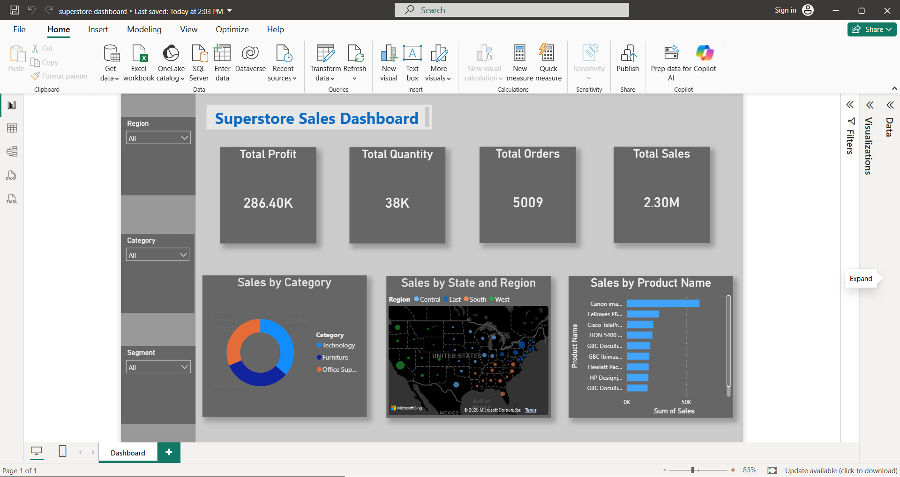

# 📊 Superstore Sales Dashboard

A Power BI dashboard built using the Sample Superstore dataset to analyze sales performance, profit, orders, and product trends through interactive visualizations.

## 📸 Dashboard Preview

## ✨ Features
- KPI Cards (Sales, Profit, Quantity, Orders)
- Sales by Category (Donut Chart)
- Sales by Region
- Top 10 Products by Sales
- Interactive Map
- Region, Category, and Segment slicers

## 🛠️ Tools Used
- Power BI Desktop
- Sample Superstore Dataset

## 📈 Key Insights
- Track overall business performance.
- Compare sales across regions.
- Identify top-selling products.
- Filter data using interactive slicers.
